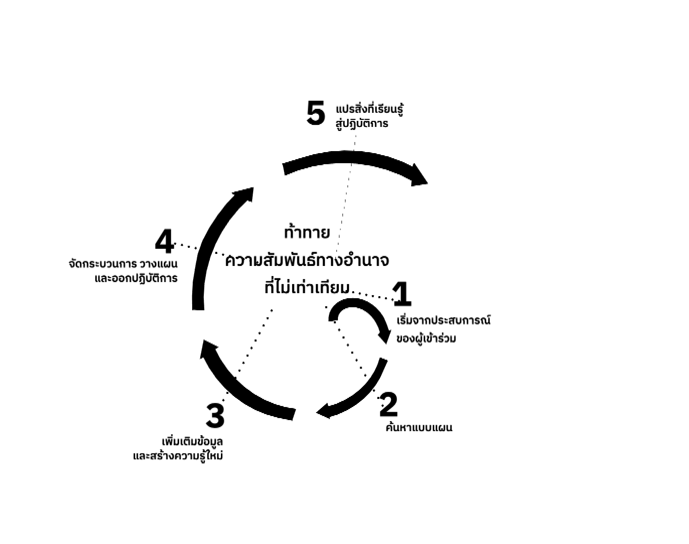

การศึกษาของประชาชนหรือว่า Popular Education เขาเรียกกันย่อๆ ทั่วไปว่า “Pop Ed” คำว่า Popular ในลาตินอเมริกามันแปลว่า “ของประชาชน” Popular Education มันก็เลยแปลว่าการศึกษาของประชาชน การศึกษานี้มันเกิดขึ้นที่ลาตินอเมริกานะครับแล้วก็ได้รับอิทธิพลมาจากแนวคิดของ เปาโล เฟรเร ด้วย ซึ่งเป็นการศึกษาที่พยายามที่จะส่งเสริมให้ประชาชนเนี่ยนะครับ สอนนักเรียนรู้กันและกัน เพื่อที่จะให้เขาสามารถรวมตัวกันเพื่อเปลี่ยนแปลงสังคมเปลี่ยนแปลงโลกให้มันดีขึ้นได้ ก็เป็นการศึกษาที่จะตรงข้ามกับกระบวนการศึกษาที่มาจากผู้ปกครองมาจากผู้กดขี่ ซึ่งมันก็จะมีกระบวนการเรียนรู้ที่แตกต่างกันไป ก็คือว่าการศึกษาของประชาชนเนี่ย เขาจะมุ่งเน้นให้คนเรียนเนี่ยนะครับ ได้กำหนดสิ่งที่ต้องการเรียนรู้ของตัวเองนะครับ ไม่ได้กำหนดมาจากผู้รู้ ผู้เป็นครู ผู้หลักผู้ใหญ่อะไรอย่างนี้นะครับ 

## เน้นให้ผู้เรียนกำหนดสิ่งที่ต้องการเรียนรู้เอง

แล้วก็ผู้สอนกับผู้เรียนเนี่ยแทบจะเป็นหนึ่งเดียวกันนะครับ หรือต่างผลัดกันเป็นผู้เรียนและผู้สอน 

## ผู้สอนกับผู้เรียนเป็นหนึ่งเดียวกัน

แล้วก็มุ่งเน้นไปที่การปลุกสำนึกที่มีต่อสังคมของผู้เรียนเป็นสำคัญ ทำให้มองเห็นว่า ประสบการณ์ส่วนตัวของตัวเราเนี่ย มันไม่ใช่แค่มีตัวของเราคนเดียวนะ มันมีคนอื่นอยู่ร่วมด้วยนะครับ มันเป็นประสบการณ์ที่มีแบบแผนร่วมกันกับคนในสังคมทั่วๆ ไป โดยเฉพาะประสบการณ์ที่เราถูกกดขี่จากสังคมที่ไม่เป็นธรรมทุกวันนี้ 

## ปลุกสำนึกต่อสังคมของผู้เรียน

กระบวนการเรียนรู้แบบนี้เนี่ยมันถูกเอาไปใช้ในกระบวนการเปลี่ยนแปลงสังคมหลายที่นะครับ มันก็จะมีหลักการแบบเป็นวงจรเหมือนกัน คล้ายๆ กับ เดวิด โคล์บ ที่ผมพูดถึงไปเมื่อกี้แต่ว่ามันจะมีทั้งหมดอยู่ 5 ขั้นตอนนะครับ ซึ่งเดี๋ยวเราจะมาดูกันตรงนี้เลย

# วงจรการเรียนรู้ของการศึกษาของประชาชน

วงจรนะครับ หรือว่าวงเกลียวของการศึกษาของประชาชนเนี่ยนะครับ มันจะมีทั้งหมดอยู่ 5 ขั้นตอน จะสังเกตว่าตรงกลางเนี่ยมันก็คือการที่บอกว่า เราจะต้องท้าทายความสัมพันธ์ทางอำนาจที่ไม่เท่าเทียมกัน คือทั้งหมดของวงจรนี้เนี่ยมันจะต้องคำนึงถึงเรื่องการท้าทายความสัมพันธ์ทางอำนาจที่ไม่เท่าเทียมกันตลอดเวลา และความสัมพันธ์เชิงอำนาจที่ไม่เท่าเทียมคืออะไร ก็เป็นความสัมพันธ์ทางอำนาจที่แบบฝ่ายหนึ่งถูกกดขี่ อีกฝ่ายหนึ่งเป็นผู้กดขี่นะครับ ซึ่งก็ฟังดูมันจะดูแบบมันดูรุนแรง ดูขัดแย้งกันเหลือเกินนะครับ แต่ว่าเอาเข้าจริงๆ มันเป็นความสัมพันธ์ที่เราพบเจอกันอยู่ทุกเมื่อเชื่อวัน ไม่ว่าจะเป็นความสัมพันธ์ทางอำนาจระหว่างครูกับนักเรียน ระหว่างผู้ปกครองนะครับ รัฐบาล ข้าราชการกับประชาชนคนรวยกับคนจน หรือแม้แต่ไม่ลำดับอาวุโส พี่กับน้อง พ่อแม่กับลูก หรือว่าคนที่มีอัตลักษณ์ที่เป็นกระแสหลักกับคนที่มีอัตลักษณ์ที่เป็นกระแสรอง เช่น พวกรักต่างเพศกับพวกรักเพศเดียวกัน คนขาวคนดำนะครับ ก็จะเป็นความสัมพันธ์ทางอำนาจที่มันไม่เท่าเทียมซึ่งตรงนี้ มันไม่ส่งเสริมความเป็นมนุษย์ที่มันเท่าเทียมกัน แล้วก็พัฒนาศักยภาพของกันและกันทั้งสองฝ่าย ไม่ว่าจะเป็นผู้กดขี่หรือว่าผู้ถูกกดขี่เองนะครับ ซึ่งบางครั้งก็ไม่รู้ตัวว่ามันเกิดสิ่งเหล่านี้กันขึ้นมา ดังนั้นวงจรการเรียนรู้ วงจรการศึกษาแบบนี้มันต้องตั้งเป้าตรงนี้ก่อนนะครับ เพื่อที่ว่าเราลองมาท้าทายความสัมพันธ์ทางอำนาจที่ไม่เท่าเทียมดูนะครับ เพื่อจะได้มองเห็นสิ่งต่างๆ แล้วก็นำไปสู่การพัฒนาความเป็นมนุษย์ร่วมกันนะครับ เพื่อสร้างสังคมที่เท่าเทียม แล้วก็เคารพศักดิ์ศรีคุณค่าของความเป็นมนุษย์ของกันและกัน

